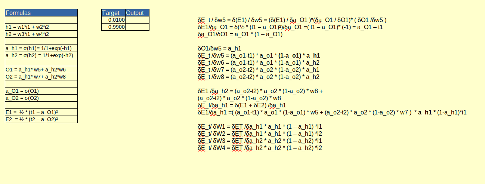

# 1 - Background & Very Basics

We started with basic of AI .We Learned  the below things.

- Why do neural networks work so well?
- Kind of data we "actually" deal with
- Feed forward Networks
- Neurons
- Mathematics
- Architectural Ingredients

**Skill_Test**:

1. Rewrite the Colab file and:
   1. remove the last activation function
   2. make sure there are in total 44 parameters
   3. run it for 2001 epochs
2. **Upload your work to a public GitHub Repository and share the link** 
3. Add a readme file to your project and describe these things:
   1. What is a neural network neuron?
   2. What is the use of the learning rate?
   3. How are weights initialized?
   4. What is "loss" in a neural network?
   5. What is the "chain rule" in gradient flow?

Put Questions : https://github.com/Code-Trees/END-GAME/issues/1

GitHub: https://github.com/Code-Trees/END-GAME/tree/main/Session_1

# 2 - BackProp, Embeddings and Language Models

Session 2 was shocking .Why ? Because we made a working neural network in Excel sheet.

We learned about

- Back propagation
- Embeddings - An analogy from Visual Domain
- Embeddings
- Neural Networks
- Heavy Math - Forward Propagation
- Back propagation
- Word Embeddings
- Modern Embeddings
- Word Embeddings vs Language Model
- Word2Vec

**Skill_Test**:

1. Rewrite the whole excel sheet showing back propagation. Explain each major step, and write it on Github. 

   1. **Use exactly the same values for all variables as used in the class**
   2. Take a screenshot, and show that screenshot in the readme file
   3. Excel file must be there for us to cross-check the image shown on readme (no image = no score)
   4. Explain each major step
   5. Show what happens to the error graph when you change the learning rate from [0.1, 0.2, 0.5, 0.8, 1.0, 2.0] 

2. Submit the GitHub link. Github link must be public (check the link without logging in, if it opens, then only share the link  ). 

   1. Sanity, please. 

   
   
   Put Questions : https://github.com/Code-Trees/END-GAME/issues/1
   
   Github:https://github.com/Code-Trees/END-GAME/tree/main/Session_2

# 3 - PyTorch

Session 3 is All about PyTorch. We learned a lot of things about PyTorch , TensorFlow. Also we worked with Tensors ,AutoGrad, Numpy functionality ,Tensor Indexing Model building in Pytorch Step by Step.

After Learning We got Task to Do. Trust Me it is Really Easy . Joking .... :-) :-)

**Skill_Test**

1. Write a neural network that can:
   1. take 2 inputs:
      1. an image from MNIST data set, and
      2. a random number between 0 and 9
   2. and gives two outputs:
      1. the "number" that was represented by the MNIST image, and
           2. the "sum" of this number with the random number that was generated and sent as the input to the network
                
   3. you can mix fully connected layers and convolution layers
   4. you can use one-hot encoding to represent the random number input as well as the "summed" output. 
2. Your code MUST be:
   1. well documented (via reamedme file on GitHub and comments in the code)
   2. must mention the data representation
   3. must mention your data generation strategy
   4. must mention how you have combined the two inputs
   5. must mention how you are evaluating your results
   6. must mention "what" results you finally got and how did you evaluate your results
   7. must mention what loss function you picked and why!
   8. training MUST happen on the GPU

Put Questions : https://github.com/Code-Trees/END-GAME/issues/1

GitHub: https://github.com/Code-Trees/END-GAME/blob/main/Session_3

# **4 - RNNs & LSTMs**

We will learn about **Recurrent Neural Networks and LSTMS**.  But let's keep in mind that how far RNNs/LSTMs are from the modern state of art.

**Skill_Test:** 

1.  Remove RNN and add LSTM to the model . 
2. Refer to this . 
   1. The questions this time are already mentioned in the file. Once you are done, then write your solutions. 

Put Questions : https://github.com/Code-Trees/END-GAME/issues/1

GitHub: https://github.com/Code-Trees/END-GAME/tree/main/Session_4
