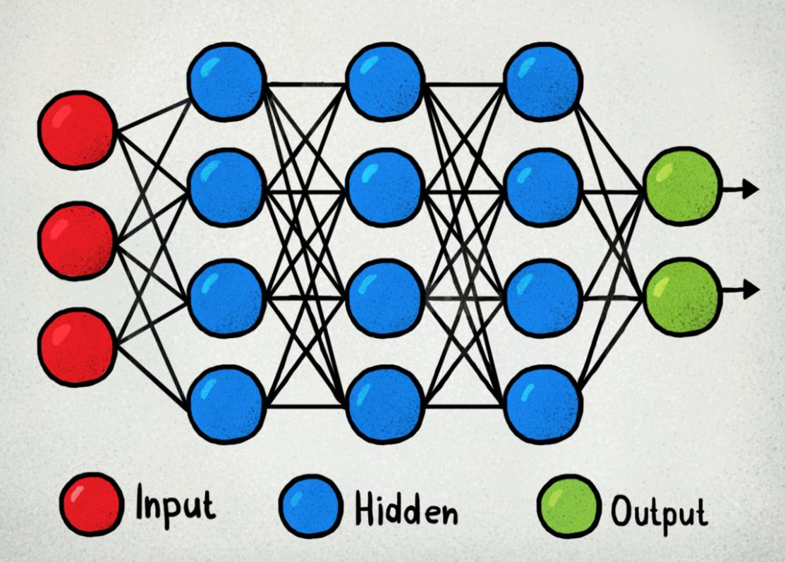

**Session 1 :- Background & Very Basics**

1. ###### What is a neural network neuron?

   **Neurons** are "containers" of mathematical functions, typically drawn as circles in Artificial Neural Networks. Neurons can belong to input layers (red circles below), hidden layers (blue circles) or output layers (green circles).

   In a simple Feed-Forward Artificial Neural Network:

   - **Input Layer Neurons** receive the numeric representations of text, image, audio and others types of data, process it through activation function and "send" an output to the next layer's neurons based in conditions. On the way to other layer's neurons, that data is multiplied by wights initiated .

   - **Hidden layer neurons** receive inputs from the input layers or by the previous hidden layer, pass them through new functions and send the result to the next layer neurons. The information  here is typically multiplied by weights generated.

   - **Output layer neurons** receive inputs from previous layers, process them through new functions and outputs the expected results. The results could be simple binary classifications , multiple choice classifications  numeric predictions etc. Depending on the type of Artificial Neural Network, this output could be used as a final result.

     

   

   

2. ###### **What is the use of the learning rate?**

   **Learning rate** **(lr)** plays a measure role in Gradient Descent. While finding the Global Minima in a gradient.  he learning rate values decide the step size to move.

   In simple terms the amount that the weights are updated during training is referred to as the step size or the “*learning rate*.”

   in general the learning rate is given as input to the optimiser. It can be a float /int type . The learning rate controls how quickly the model is adapted to the problem. Smaller learning rates require more training epochs given the smaller changes made to the weights each update, whereas larger learning rates result in rapid changes and require fewer training epochs.

   A learning rate that is too large can cause the model to converge too quickly to a sub optimal solution, whereas a learning rate that is too small can cause the process to get stuck. The challenge of training deep learning neural networks involves carefully selecting the learning rate. It may be the most important hyper parameter for the model.

   

3. ###### How are weights initialised?

   The weights are initialised with some normally distributed random numbers. Later these weights are updated during training using back propagation.

   But Why ?

   Because we don't know  what are the weights  should be. Let's say if we generate some weights in a specific cluster and the requires weights are in other cluster the entropy for the weights from one cluster to another will be higher. AS we might have a lot of weights the entropy of there movement also can be higher.

   So we generate the wights in such a way that they don't belong to any cluster and they are uniformly randomly distributed. 

4. ###### What is "loss" in a neural network?

   In NN: NN needs to get the idea of how much error it is doing to predict the actual number . Loss function is  the amount of error generated   between actual out put and predicted output  and the objective of NN is to minimise loss. 

