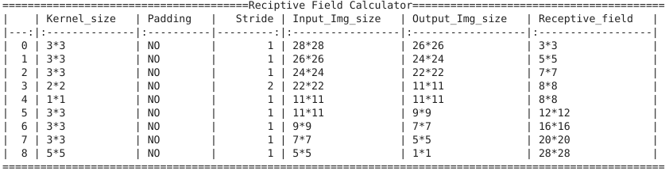

# PyTorch

In This Assignment We have to Build 

1. Write a neural network that can:
   1. take 2 inputs:
      1. an image from MNIST data set, and
      2. a random number between 0 and 9
   2. and gives two outputs:
      1. the "number" that was represented by the MNIST image, and
      2. the "sum" of this number with the random number that was generated and sent as the input to the network
         
   3. you can mix fully connected layers and convolution layers
   4. you can use one-hot encoding to represent the random number input as well as the "summed" output. 


1>**Data representation.**

​	This problem statement need 2 types of data as input. 1> Image 2> A random number. The output of the data is going to be 1> Classifying what is the digit in the image . and the sum of The digit and random number.

For this Problem we are using MNIST data set. MNIST Handwritten Digit Classification Dataset. It is  of 60,000 small square 28×28 pixel grayscale images of handwritten single digits between 0 and 9 for training and 10,000 data points for testing.

We are using Numpy to create a 60000 Random Numbers to generate between 0 to 9  . And using 19 (0.....18) classes to represent the sum .

2> **Data generation strategy**

​	To Create  the data we have the Function called **data_generator**. which helps us returning  the Image , Label ,random number ,  sum  value  which we can use to create a Data loader.

**MNISTRandom_loader** Is the data loader which Gives us the required data for the model to Train and Test. We have Done one hot encoding to the random numbers and sum outputs in the loader function. 

3>**How you have combined the two inputs ?** 

​	Now we have to combine the Two inputs  to pass in the model. To do so  once we have the data from data loader we train the model 1 i.e **MNISt** with the image data and return the features of **shape [1,10]**. Then we have the **MNISTadder**  which needs to be trained for the sum function. for that we have concatenated   the Output on model 1 and input  using **torch.cat([mnist_d,Num],dim  = -1)** . where **mnist_d** is of **[1,10] shape**  and  **Num** is **[1,10] shape** . Output of the concatenation is **[1,20] shape**  .

```python
----------------------------------------------------------------
        Layer (type)               Output Shape         Param #
================================================================
            Conv2d-1           [-1, 10, 26, 26]              90
       BatchNorm2d-2           [-1, 10, 26, 26]              20
              ReLU-3           [-1, 10, 26, 26]               0
           Dropout-4           [-1, 10, 26, 26]               0
            Conv2d-5           [-1, 10, 24, 24]             900
       BatchNorm2d-6           [-1, 10, 24, 24]              20
              ReLU-7           [-1, 10, 24, 24]               0
           Dropout-8           [-1, 10, 24, 24]               0
            Conv2d-9           [-1, 15, 22, 22]           1,350
      BatchNorm2d-10           [-1, 15, 22, 22]              30
             ReLU-11           [-1, 15, 22, 22]               0
        MaxPool2d-12           [-1, 15, 11, 11]               0
           Conv2d-13           [-1, 10, 11, 11]             150
      BatchNorm2d-14           [-1, 10, 11, 11]              20
             ReLU-15           [-1, 10, 11, 11]               0
          Dropout-16           [-1, 10, 11, 11]               0
           Conv2d-17             [-1, 10, 9, 9]             900
      BatchNorm2d-18             [-1, 10, 9, 9]              20
             ReLU-19             [-1, 10, 9, 9]               0
          Dropout-20             [-1, 10, 9, 9]               0
           Conv2d-21             [-1, 10, 7, 7]             900
      BatchNorm2d-22             [-1, 10, 7, 7]              20
             ReLU-23             [-1, 10, 7, 7]               0
          Dropout-24             [-1, 10, 7, 7]               0
           Conv2d-25             [-1, 10, 5, 5]             900
      BatchNorm2d-26             [-1, 10, 5, 5]              20
             ReLU-27             [-1, 10, 5, 5]               0
          Dropout-28             [-1, 10, 5, 5]               0
           Conv2d-29             [-1, 10, 1, 1]           2,500
            MNISt-30       [[-1, 10], [-1, 10]]               0
           Linear-31                   [-1, 32]             672
      BatchNorm1d-32                   [-1, 32]              64
             ReLU-33                   [-1, 32]               0
          Dropout-34                   [-1, 32]               0
           Linear-35                   [-1, 64]           2,112
      BatchNorm1d-36                   [-1, 64]             128
             ReLU-37                   [-1, 64]               0
          Dropout-38                   [-1, 64]               0
           Linear-39                  [-1, 128]           8,320
      BatchNorm1d-40                  [-1, 128]             256
             ReLU-41                  [-1, 128]               0
          Dropout-42                  [-1, 128]               0
           Linear-43                   [-1, 19]           2,451
```


For the image model we have the Receptive field calculated .

 


4> **What results you finally got and how did you evaluate your results ?**


