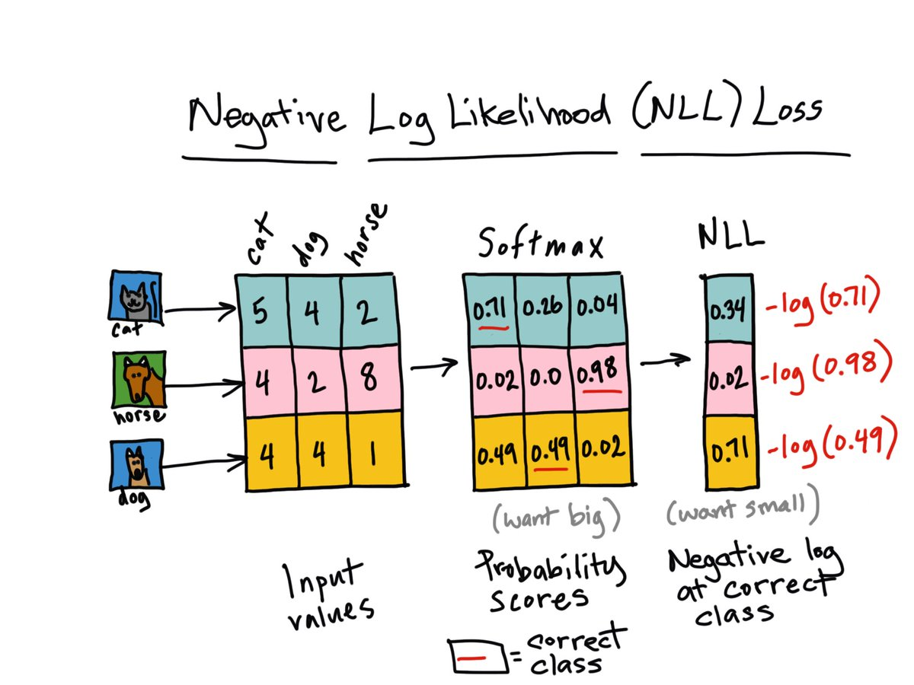

# PyTorch Model Building 

In This Assignment We have to Build 

1. Write a neural network that can:
   1. take 2 inputs:
      1. an image from MNIST data set, and
      2. a random number between 0 and 9
   2. and gives two outputs:
      1. the "number" that was represented by the MNIST image, and
      2. the "sum" of this number with the random number that was generated and sent as the input to the network
         
   3. you can mix fully connected layers and convolution layers
   4. you can use one-hot encoding to represent the random number input as well as the "summed" output. 

Github : 

[1]: https://github.com/Code-Trees/END-GAME/blob/main/Session_3/Session_3.ipynb	"GitHub notebook Link "


### 1>**Data representation.**

​	This problem statement need 2 types of data as input. 1> Image 2> A random number. The output of the data is going to be 1> Classifying what is the digit in the image . and the sum of The digit and random number.

For this Problem we are using MNIST data set. MNIST Handwritten Digit Classification Dataset. It is  of 60,000 small square 28×28 pixel grayscale images of handwritten single digits between 0 and 9 for training and 10,000 data points for testing.

We are using Numpy to create a 60000 Random Numbers to generate between 0 to 9  . And using 19 (0.....18) classes to represent the sum .

### 2>**Data generation strategy**

​	To Create  the data we have the Function called **data_generator**. which helps us returning  the Image , Label ,random number ,  sum  value  which we can use to create a Data loader.

**MNISTRandom_loader** Is the data loader which Gives us the required data for the model to Train and Test. We have Done one hot encoding to the random numbers and sum outputs in the loader function. 

### 3>**How you have combined the two inputs ?** 

​	Now we have to combine the Two inputs  to pass in the model. To do so  once we have the data from data loader we train the model 1 i.e **MNISt** with the image data and return the features of **shape [1,10]**. Then we have the **MNISTadder**  which needs to be trained for the sum function. for that we have concatenated   the Output on model 1 and input  using **torch.cat([mnist_d,Num],dim  = -1)** . where **mnist_d** is of **[1,10] shape**  and  **Num** is **[1,10] shape** . Output of the concatenation is **[1,20] shape**  .

To understand Better let's Visualise the Graph.


- **Blue boxes**: these correspond to the **tensors** we use as **parameters**, the ones we’re asking PyTorch to **compute gradients** for;
- **Gray box**: a **Python operation** that involves a **gradient-computing tensor** or **its dependencies**;
- **Green box**: the same as the Gray box, except it is the **starting point for the computation** of gradients (assuming the **backward() **method is called from the **variable used to visualize** the graph)— they are computed from the **bottom-up** in a graph.


```python
----------------------------------------------------------------
        Layer (type)               Output Shape         Param #
================================================================
            Conv2d-1           [-1, 10, 26, 26]              90 
       BatchNorm2d-2           [-1, 10, 26, 26]              20	
              ReLU-3           [-1, 10, 26, 26]               0
           Dropout-4           [-1, 10, 26, 26]               0
            Conv2d-5           [-1, 10, 24, 24]             900
       BatchNorm2d-6           [-1, 10, 24, 24]              20
              ReLU-7           [-1, 10, 24, 24]               0
           Dropout-8           [-1, 10, 24, 24]               0
            Conv2d-9           [-1, 15, 22, 22]           1,350
      BatchNorm2d-10           [-1, 15, 22, 22]              30
             ReLU-11           [-1, 15, 22, 22]               0
        MaxPool2d-12           [-1, 15, 11, 11]               0
           Conv2d-13           [-1, 10, 11, 11]             150
      BatchNorm2d-14           [-1, 10, 11, 11]              20
             ReLU-15           [-1, 10, 11, 11]               0
          Dropout-16           [-1, 10, 11, 11]               0
           Conv2d-17             [-1, 10, 9, 9]             900
      BatchNorm2d-18             [-1, 10, 9, 9]              20
             ReLU-19             [-1, 10, 9, 9]               0
          Dropout-20             [-1, 10, 9, 9]               0
           Conv2d-21             [-1, 10, 7, 7]             900
      BatchNorm2d-22             [-1, 10, 7, 7]              20
             ReLU-23             [-1, 10, 7, 7]               0
          Dropout-24             [-1, 10, 7, 7]               0
           Conv2d-25             [-1, 10, 5, 5]             900
      BatchNorm2d-26             [-1, 10, 5, 5]              20
             ReLU-27             [-1, 10, 5, 5]               0
          Dropout-28             [-1, 10, 5, 5]               0
           Conv2d-29             [-1, 10, 1, 1]           2,500
            MNISt-30       [[-1, 10], [-1, 10]]               0   <-Concatenated CNN_Model1 o/p to Model2 
           Linear-31                   [-1, 32]             672
      BatchNorm1d-32                   [-1, 32]              64
             ReLU-33                   [-1, 32]               0
          Dropout-34                   [-1, 32]               0
           Linear-35                   [-1, 64]           2,112
      BatchNorm1d-36                   [-1, 64]             128
             ReLU-37                   [-1, 64]               0
          Dropout-38                   [-1, 64]               0
           Linear-39                  [-1, 128]           8,320
      BatchNorm1d-40                  [-1, 128]             256
             ReLU-41                  [-1, 128]               0
          Dropout-42                  [-1, 128]               0
           Linear-43                   [-1, 19]           2,451
```


For the image model we have the Receptive field calculated .

 


### 4> **What results you finally got and how did you evaluate your results ?**


Above is the  Loss graph for the model. The Loss is the combination of Loss 1 And Loss 2. where Loss one is 			**F.nll_loss(y_pred1, target1)** and Loss 2 is **nn.CrossEntropyLoss()**. To do this calculation of loss we have created a function total_loss.

**Training model Epochs** 

*epochs : 25*

*Batch size = 128*

*Lr : 0.01 (Not used any tool for finding correct lr yet)*

*optimizer: SGD*


Accuracy1,Loss1 = MNIST model accuracy and loss

Accuracy 2,loss2 = Sum model accuracy  and loss

```python
EPOCH: 18
 Loss1=0.008599606342613697 and loss2 0.005282520782202482 Batch_id=468 Accuracy1=99.51,Accuracy2=99.22: 100%|██████████| 469/469 [00:09<00:00, 50.27it/s]  
  0%|          | 0/469 [00:00<?, ?it/s]
Test set: Average loss: 0.0000, Accuracy1: 9928/10000 (99.28%),Accuracy2: 9912/10000 (99.12%)

EPOCH: 19
 Loss1=0.02737552486360073 and loss2 0.027035050094127655 Batch_id=468 Accuracy1=99.51,Accuracy2=99.12: 100%|██████████| 469/469 [00:08<00:00, 54.29it/s]   
  0%|          | 0/469 [00:00<?, ?it/s]
Test set: Average loss: 0.0000, Accuracy1: 9915/10000 (99.15%),Accuracy2: 9897/10000 (98.97%)

EPOCH: 20
 Loss1=0.01477010641247034 and loss2 0.022565452381968498 Batch_id=468 Accuracy1=99.50,Accuracy2=99.15: 100%|██████████| 469/469 [00:08<00:00, 55.22it/s]   
  0%|          | 0/469 [00:00<?, ?it/s]
Test set: Average loss: 0.0000, Accuracy1: 9922/10000 (99.22%),Accuracy2: 9901/10000 (99.01%)

EPOCH: 21
 Loss1=0.006854261737316847 and loss2 0.006861551199108362 Batch_id=468 Accuracy1=99.59,Accuracy2=99.24: 100%|██████████| 469/469 [00:08<00:00, 55.23it/s]  
  0%|          | 0/469 [00:00<?, ?it/s]
Test set: Average loss: 0.0000, Accuracy1: 9922/10000 (99.22%),Accuracy2: 9905/10000 (99.05%)

EPOCH: 22
 Loss1=0.02853153645992279 and loss2 0.031161749735474586 Batch_id=468 Accuracy1=99.58,Accuracy2=99.25: 100%|██████████| 469/469 [00:08<00:00, 56.40it/s]   
  0%|          | 0/469 [00:00<?, ?it/s]
Test set: Average loss: 0.0000, Accuracy1: 9924/10000 (99.24%),Accuracy2: 9914/10000 (99.14%)

EPOCH: 23
 Loss1=0.007539309561252594 and loss2 0.01256039272993803 Batch_id=468 Accuracy1=99.61,Accuracy2=99.27: 100%|██████████| 469/469 [00:08<00:00, 55.48it/s]   
  0%|          | 0/469 [00:00<?, ?it/s]
Test set: Average loss: 0.0000, Accuracy1: 9914/10000 (99.14%),Accuracy2: 9894/10000 (98.94%)

EPOCH: 24
 Loss1=0.015108499675989151 and loss2 0.06173732876777649 Batch_id=468 Accuracy1=99.60,Accuracy2=99.31: 100%|██████████| 469/469 [00:09<00:00, 50.92it/s]   
Test set: Average loss: 0.0000, Accuracy1: 9932/10000 (99.32%),Accuracy2: 9916/10000 (99.16%)
```

 **Testing the model** 

```python
y_pred1,y_pred2 = model(data1,data2)  # Getting the Model output for a batch 
loss1,loss2 = total_loss(y_pred1, target1,y_pred2, target2.argmax(dim = 1)) #Calculating total loss from a custom function 
test_losses1 += loss1.item() # sum up batch loss1 MNIST
test_losses2 += loss2.item() # sum up batch loss2 Adder
pred = y_pred1.argmax(dim=1, keepdim=True)  # get the index of the max log-probability
correct += pred.eq(target1.view_as(pred)).sum().item() #Chceking the correct class for Image 
second_correct += y_pred2.argmax(dim =1).eq(target2.argmax(dim = 1)).sum().item() #Chceking the correct class for Summ function 
```

### 5>**What loss function you picked and why ?**

- For The **MNISt  (CNN) model ** We are using the Loss function as **The negative log likelihood loss.**

The negative log-likelihood is bad  at smaller values, where it can reach infinite (that's too sad), and becomes good  at larger values. *Because we are summing the loss function to all the correct classes*, what's actually happening is that whenever the network assigns high confidence at the correct class, the **unhappiness** is low, and vice-versa. The input given through a forward call is expected to contain log-probabilities of each class. Means it needs a  LogSoftmax layer before this .

Formula: 
$$
Hp(q) = -1/N ∑ yi * log(p(yi)) + (1-yi) * log(1-p(yi))
$$


 

- For the Numeric model I tried  **CrossEntropyLoss**.

because from the PyTorch Documentation **[](https://pytorch.org/docs/stable/generated/torch.nn.NLLLoss.html#torch.nn.NLLLoss)** I  learned that Obtaining log-probabilities in a neural network is easily achieved by adding a LogSoftmax layer in the last layer of your network. We may use CrossEntropyLoss instead, if you prefer not to add an extra layer. 

As we don't have a LogSoftmax layer in **MNISTadder  (Summing ) model** .

Formula:
$$
loss(x,class)=−log( 
∑ 
j
​	
 exp(x[j])
exp(x[class])
​	
 )=−x[class]+log( 
j
∑
​	
 exp(x[j]))
$$


### 6>**MUST happen on the GPU**

Created A GPU checker function To return  the GPU information. 

```python
def gpu_check(seed_val = 1):
    print('The Seed is set to {}'.format(seed_val))
    if torch.cuda.is_available():
        print('Model will Run on CUDA.')
        print ("Type 'watch nvidia-smi' to monitor GPU\n")
        torch.cuda.manual_seed(seed_val)
        device = 'cuda'
    else:
        torch.manual_seed(seed_val)
        print ('Running in CPU')
        device = 'cpu'
    cuda = torch.cuda.is_available()
    return cuda,seed_val,device
```

```python
The Seed is set to 1
Model will Run on CUDA.
Type 'watch nvidia-smi' to monitor GPU

(True, 1, 'cuda')
     
+-----------------------------------------------------------------------------+
| NVIDIA-SMI 460.73.01    Driver Version: 460.73.01    CUDA Version: 11.2     |
|-------------------------------+----------------------+----------------------+
| GPU  Name        Persistence-M| Bus-Id        Disp.A | Volatile Uncorr. ECC |
| Fan  Temp  Perf  Pwr:Usage/Cap|         Memory-Usage | GPU-Util  Compute M. |
|                               |                      |               MIG M. |
|===============================+======================+======================|
|   0  GeForce GTX 960M    Off  | 00000000:01:00.0 Off |                  N/A |
| N/A   57C    P5    N/A /  N/A |   1072MiB /  4046MiB |     12%      Default |
|                               |                      |                  N/A |
+-------------------------------+----------------------+----------------------+
                                                                               
+-----------------------------------------------------------------------------+
| Processes:                                                                  |
|  GPU   GI   CI        PID   Type   Process name                  GPU Memory |
|        ID   ID                                                   Usage      |
|=============================================================================|
|    0   N/A  N/A      3710      G   /usr/lib/xorg/Xorg                241MiB |
|    0   N/A  N/A      3968      G   /usr/bin/gnome-shell               41MiB |
|    0   N/A  N/A     20373      C   ...nda3/envs/eva5/bin/python      689MiB |
|    0   N/A  N/A     33693      G   ...AAAAAAAAA= --shared-files       94MiB |
+-----------------------------------------------------------------------------+
```

To Push the mode to GPU we have send all the Data and target to device = 'cuda' by using the below code.

- ```python
  model2 = MNISTadder().to(device)
  data1, target1 = data1.to(device), target1.to(device)
  data2, target2 = data2.to(device), target2.to(device)
  # Checking the TRUTH :-)
  next(model2.parameters()).is_cuda
  True
  ```

