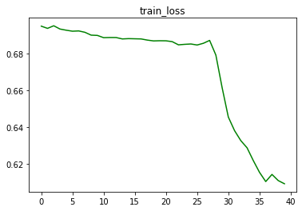
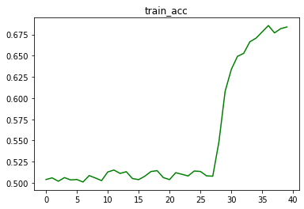

# **4 - RNNs & LSTMs**

**ToDo:** 

1. Refer to online remove RNN and add LSTM to the model. 
2. Refer to this  . 
   1. The questions this time are already mentioned in the file. Take as much time as you want (but less than 7 days), to solve the file. Once you are done, then write your solutions in the quiz. 
   2. Please note that the **Session 4 Assignment Solution** will time out after 15 minutes, as you just have to copy-paste your answers. 


------


## **LSTM_Sentiment_analysis model**

​	We are Replacing the RNN model with LSTM , modifying the code to make it  functional . Please find the RNN model link attached .

https://github.com/Code-Trees/END-GAME/blob/main/Session_4/RNN_model.ipynb

[here]: https://github.com/Code-Trees/END-GAME/blob/main/Session_4/RNN_model.ipynb	"RNN code"

##### **<u>Tokenizer:</u>**  

As this is for learning purpose we are first modifying the **tokenizer Spacy**  to a simple by by adding the below code . **What is tokenizer ?** Tokenization is a way of separating a piece of text into smaller units called tokens. Here, tokens can be either words, characters, or sub words. Hence, tokenization can be broadly classified into 3 types – word, character, and sub word (n-gram characters) tokenization.

```python
# just split the data by " "(space) between the words.
def tokenize(s):
    return s.split(' ')

TEXT = Field(tokenize = tokenize,tokenizer_language = 'en_core_web_sm', lower = True)
LABEL = LabelField(dtype = torch.float)
```


##### **<u>Data prep:</u>** 

Once we have the tokenizer lets Split the data . In our case we have the IMDB rating Dataset. This data set is having  50,000 reviews with target as positive / negative. We will split the data with Train data, Validation_data , Test_data with , 17500,7500,25000 split respectively. 

Once we have the data splits we can build vocab from training data. 

```python
# Build vocabulary for source and target from training data

TEXT.build_vocab(train_data, max_size=25_000)
LABEL.build_vocab(train_data)
```

##### <u>**Model Building :**</u> 

We have the model Code ready from RNN code. Let's modify it with below updates. 

1. Input dim:  The Shape of Vocabulary ,that can be the max length of a sentence. 

2. output_dim : len ([positive, negative]) == 2

3. emb_dim : Dimension of embedding matrix

4. hidden_dim : Num of hidden dimension.

5. n_layer: How many LSTM layers to build

6. dropout: The dropout value 

   ```python
   INPUT_DIM = len(TEXT.vocab)
   OUTPUT_DIM = len(LABEL.vocab)
   EMBEDDING_DIM = 100
   HIDDEN_DIM = 256
   N_LAYERS = 1
   DROPOUT = 0.6 #We are going hard on the model bu telling to drop 60% of the neurons and learn . 
   ```

```python
# Model class
class Model(nn.Module):
    def __init__(self, input_dim, output_dim,emb_dim, hidden_dim, n_layers, dropout):
        super(Model, self).__init__()
        self.n_layers = n_layers
        self.hidden_dim = hidden_dim

        self.embedding = nn.Embedding(input_dim, emb_dim)
        self.rnn = nn.LSTM(emb_dim, hidden_dim, n_layers, dropout=dropout)
        
        self.fc1 = nn.Linear(hidden_dim, output_dim)
        self.relu = nn.ReLU()
        self.dropout = nn.Dropout(dropout)

    def forward(self, src):
        # shape: [source_len, batch_size]
        embedded = self.dropout(self.embedding(src)) # shape: [src_len, batch_size, embed_dim]
        output, (hidden, cell) = self.rnn(embedded) 
        # output shape -> [batch, hidden_dim]
        # hiddden shape -> [n_layers, batch, hidden_dim]
        # cell shape -> [n_layers, batch, hidden_dim]
        output = self.fc1(output[-1])
#         output = self.fc2(self.relu(output))
        return output
```


We are running the model is Cuda.

```python
def gpu_check(seed_val = 1):
    print('The Seed is set to {}'.format(seed_val))
    if torch.cuda.is_available():
        print('Model will Run on CUDA.')
        print ("Type 'watch nvidia-smi' to monitor GPU\n")
        torch.cuda.manual_seed(seed_val)
        device = 'cuda'
    else:
        torch.manual_seed(seed_val)
        print ('Running in CPU')
        device = 'cpu'
    cuda = torch.cuda.is_available()
    return cuda,seed_val,device
```


```python
In [8]:cuda,SEED,device = gpu_check(seed_val=1234)

The Seed is set to 1234
Model will Run on CUDA.
Type 'watch nvidia-smi' to monitor GPU
```

```shell
+-----------------------------------------------------------------------------+
| NVIDIA-SMI 465.19.01    Driver Version: 460.32.03    CUDA Version: 11.2     |
|-------------------------------+----------------------+----------------------+
| GPU  Name        Persistence-M| Bus-Id        Disp.A | Volatile Uncorr. ECC |
| Fan  Temp  Perf  Pwr:Usage/Cap|         Memory-Usage | GPU-Util  Compute M. |
|                               |                      |               MIG M. |
|===============================+======================+======================|
|   0  Tesla P100-PCIE...  Off  | 00000000:00:04.0 Off |                    0 |
| N/A   53C    P0    43W / 250W |      2MiB / 16280MiB |      0%      Default |
|                               |                      |                  N/A |
+-------------------------------+----------------------+----------------------+
                                                                               
+-----------------------------------------------------------------------------+
| Processes:                                                                  |
|  GPU   GI   CI        PID   Type   Process name                  GPU Memory |
|        ID   ID                                                   Usage      |
|=============================================================================|
|  No running processes found                                                 |
+-----------------------------------------------------------------------------+
```


##### <u>**Train Test Loop : **</u> 

We are using **Adam** as optimiser, Also **lr_scheduler** to find the best Learning rate. Loss as **CrossEntropyLoss**.

Let's create The train loop , evaluate loop to run test loop and validation loop with below code.

```python
def train(EPOCH,model, iterator, optimizer=optimizer, criterion=criterion, clip=1,):
    model.train()
    epoch_loss = 0
    total_correct = 0
    total_count = 0
    pbar = tqdm(iterator)
    for i, batch in enumerate(pbar):
        src = batch.text.to(device)
        trg = batch.label.to(device)
        trg = trg.long()
        optimizer.zero_grad()
        output = model(src)
        
        total_correct += torch.sum(torch.eq(output.argmax(1), trg))
        total_count+=len(trg)
        
        loss = criterion(output, trg)
        
        loss.backward() 
        torch.nn.utils.clip_grad_norm_(model.parameters(), clip)
        optimizer.step()
        epoch_loss += loss.item()
        pbar.set_description(desc= f'Epoch {EPOCH} Train data Batch No : {i} Loss : {loss.item():.3f} Accuracy : {total_correct/total_count * 100 :.2f}% ' )
    
    train_accuracy.append(total_correct/total_count)
    mean_loss = epoch_loss / len(iterator)
    train_loss.append(mean_loss)
    
    scheduler.step(mean_loss)
```

```python
def evaluate(EPOCH,model, iterator, criterion,typ_loader):
    
    epoch_loss = 0
    epoch_acc = 0
    
    model.eval()
    pbar  = tqdm(iterator)
    with torch.no_grad():
        
        for i,batch in enumerate(pbar):
            src = batch.text.to(device)
            trg = batch.label.to(device)
            trg = trg.long()
            predictions = model(src)
            
            loss = criterion(predictions, trg)
            
            acc = binary_accuracy(predictions, trg)

            epoch_loss += loss.item()
            epoch_acc += acc
            pbar.set_description(desc= f'Epoch {EPOCH} {typ_loader} Batch No : {i} Loss : {loss.item():.3f} Accuracy : {epoch_acc / len(iterator)* 100 :.2f}% ' )
```

##### <u>**Model Running And o/p:**</u>

to Run the model we run below code:

###### **EPOCHS = 5**

```python
total_epoch = 5
for epoch in range(total_epoch):
    result = train(epoch,model=model, iterator=train_iterator)
    evaluate(epoch,model,valid_iterator,criterion,'Valid data')
    evaluate(epoch,model,test_iterator,criterion,'Test data')
```

The O/P of our Mehnat is below.

```python
Epoch 0 Train data Batch No : 546 Loss : 0.701 Accuracy : 49.77% : 100%|██████████| 547/547 [00:37<00:00, 14.55it/s]
Epoch 0 Valid data Batch No : 234 Loss : 0.692 Accuracy : 50.31% : 100%|██████████| 235/235 [00:02<00:00, 86.82it/s]
Epoch 0 Test data Batch No : 781 Loss : 0.678 Accuracy : 37.39% : 100%|██████████| 782/782 [00:09<00:00, 86.53it/s]
Epoch 1 Train data Batch No : 546 Loss : 0.705 Accuracy : 49.93% : 100%|██████████| 547/547 [00:37<00:00, 14.44it/s]
Epoch 1 Valid data Batch No : 234 Loss : 0.686 Accuracy : 49.99% : 100%|██████████| 235/235 [00:02<00:00, 89.57it/s]
Epoch 1 Test data Batch No : 781 Loss : 0.704 Accuracy : 57.17% : 100%|██████████| 782/782 [00:08<00:00, 88.91it/s]
Epoch 2 Train data Batch No : 546 Loss : 0.718 Accuracy : 50.41% : 100%|██████████| 547/547 [00:37<00:00, 14.41it/s]
Epoch 2 Valid data Batch No : 234 Loss : 0.692 Accuracy : 51.52% : 100%|██████████| 235/235 [00:02<00:00, 89.56it/s]
Epoch 2 Test data Batch No : 781 Loss : 0.629 Accuracy : 46.12% : 100%|██████████| 782/782 [00:08<00:00, 89.88it/s]
Epoch 3 Train data Batch No : 546 Loss : 0.679 Accuracy : 50.71% : 100%|██████████| 547/547 [00:37<00:00, 14.61it/s]
Epoch 3 Valid data Batch No : 234 Loss : 0.685 Accuracy : 50.16% : 100%|██████████| 235/235 [00:02<00:00, 89.85it/s]
Epoch 3 Test data Batch No : 781 Loss : 0.741 Accuracy : 57.04% : 100%|██████████| 782/782 [00:08<00:00, 89.43it/s]
Epoch 4 Train data Batch No : 546 Loss : 0.719 Accuracy : 50.35% : 100%|██████████| 547/547 [00:37<00:00, 14.60it/s]
Epoch 4 Valid data Batch No : 234 Loss : 0.711 Accuracy : 49.58% : 100%|██████████| 235/235 [00:02<00:00, 88.88it/s]
Epoch 4 Test data Batch No : 781 Loss : 0.778 Accuracy : 56.24% : 100%|██████████| 782/782 [00:08<00:00, 89.35it/s]
```

The model is Not performing well in 5 epochs 

**Train Accuracy : ------------> 50.35%  (Very bad)**

**Validation Accuracy  -----> 49.58 (Better to flip a coin)**

**Test Accuracy :--------------> 56.34  ( Just got a bit lucky )**


A function to Check random sentiments: 

```python
mport spacy
sp = spacy.load('en_core_web_sm')

def predict(sentence):
    if type(sentence) == str:
        tokanized_sentence = [word.text for word in sp.tokenizer(sentence)]
    else:
        tokanized_sentence = sentence


    input_data = [TEXT.vocab.stoi[word.lower()] for word in tokanized_sentence]
    input_data = torch.tensor(input_data, dtype=torch.int64).unsqueeze(1).to(device)


    model.eval()
    output = model(input_data)
    # print(output)
    predict = output.argmax(1)
    predict = predict.squeeze(0)
    print(output)

    if predict>0:
        return "---->> Positive Review"
    else:
        return '---->> Negative Review'
```

```python
In [31]:
predict('Very bad') # predict funciton will predict if this is positive or negative review.
tensor([[ 0.9696, -0.5756]], device='cuda:0', grad_fn=<AddmmBackward>)
Out[31]:
'---->> Negative Review'
In [32]:
predict('Very good') # predict funciton will predict if this is positive or negative review.
tensor([[0.0022, 0.0456]], device='cuda:0', grad_fn=<AddmmBackward>)
Out[32]:
'---->> Positive Review'
In [34]:
predict('i recommend to watch the movie once. It is mindblowing') # predict funciton will predict if this is positive or negative review.
tensor([[ 0.2117, -0.0614]], device='cuda:0', grad_fn=<AddmmBackward>)
Out[34]:
'---->> Negative Review'
```


Now Let's Try running it with More epochs and let's use Spacy to see the difference.

###### **EPOCH = 30** + 10  

```python
Epoch 0 Train data Batch No : 546 Loss : 0.689 Accuracy : 50.39% : 100%|██████████| 547/547 [00:39<00:00, 14.01it/s]
Epoch 0 Valid data Batch No : 234 Loss : 0.680 Accuracy : 50.70% : 100%|██████████| 235/235 [00:02<00:00, 94.77it/s]
Epoch 0 Test data Batch No : 781 Loss : 0.691 Accuracy : 59.86% : 100%|██████████| 782/782 [00:08<00:00, 97.39it/s]
Epoch 1 Train data Batch No : 546 Loss : 0.704 Accuracy : 50.59% : 100%|██████████| 547/547 [00:39<00:00, 13.97it/s]
Epoch 1 Valid data Batch No : 234 Loss : 0.709 Accuracy : 50.36% : 100%|██████████| 235/235 [00:02<00:00, 94.14it/s]
Epoch 1 Test data Batch No : 781 Loss : 0.704 Accuracy : 56.90% : 100%|██████████| 782/782 [00:08<00:00, 97.40it/s]
Epoch 2 Train data Batch No : 546 Loss : 0.695 Accuracy : 50.19% : 100%|██████████| 547/547 [00:39<00:00, 13.96it/s]
Epoch 2 Valid data Batch No : 234 Loss : 0.692 Accuracy : 49.76% : 100%|██████████| 235/235 [00:02<00:00, 96.10it/s]
Epoch 2 Test data Batch No : 781 Loss : 0.667 Accuracy : 65.44% : 100%|██████████| 782/782 [00:07<00:00, 99.12it/s]
Epoch 3 Train data Batch No : 546 Loss : 0.678 Accuracy : 50.62% : 100%|██████████| 547/547 [00:39<00:00, 13.94it/s]
Epoch 3 Valid data Batch No : 234 Loss : 0.797 Accuracy : 50.20% : 100%|██████████| 235/235 [00:02<00:00, 95.54it/s]
Epoch 3 Test data Batch No : 781 Loss : 0.712 Accuracy : 55.87% : 100%|██████████| 782/782 [00:07<00:00, 98.03it/s]
Epoch 4 Train data Batch No : 546 Loss : 0.702 Accuracy : 50.35% : 100%|██████████| 547/547 [00:39<00:00, 13.90it/s]
Epoch 4 Valid data Batch No : 234 Loss : 0.760 Accuracy : 51.24% : 100%|██████████| 235/235 [00:02<00:00, 94.89it/s]
Epoch 4 Test data Batch No : 781 Loss : 0.700 Accuracy : 57.70% : 100%|██████████| 782/782 [00:07<00:00, 97.89it/s]
Epoch 5 Train data Batch No : 546 Loss : 0.699 Accuracy : 50.40% : 100%|██████████| 547/547 [00:39<00:00, 13.86it/s]
Epoch 5 Valid data Batch No : 234 Loss : 0.661 Accuracy : 52.41% : 100%|██████████| 235/235 [00:02<00:00, 94.64it/s]
Epoch 5 Test data Batch No : 781 Loss : 0.679 Accuracy : 52.35% : 100%|██████████| 782/782 [00:07<00:00, 97.92it/s]
Epoch 6 Train data Batch No : 546 Loss : 0.679 Accuracy : 50.10% : 100%|██████████| 547/547 [00:39<00:00, 13.93it/s]
Epoch 6 Valid data Batch No : 234 Loss : 0.724 Accuracy : 55.51% : 100%|██████████| 235/235 [00:02<00:00, 93.84it/s]
Epoch 6 Test data Batch No : 781 Loss : 0.718 Accuracy : 57.09% : 100%|██████████| 782/782 [00:08<00:00, 97.29it/s]
Epoch 7 Train data Batch No : 546 Loss : 0.695 Accuracy : 50.86% : 100%|██████████| 547/547 [00:39<00:00, 13.90it/s]
Epoch 7 Valid data Batch No : 234 Loss : 0.693 Accuracy : 52.15% : 100%|██████████| 235/235 [00:02<00:00, 94.41it/s]
Epoch 7 Test data Batch No : 781 Loss : 0.755 Accuracy : 58.32% : 100%|██████████| 782/782 [00:08<00:00, 97.57it/s]
Epoch 8 Train data Batch No : 546 Loss : 0.681 Accuracy : 50.58% : 100%|██████████| 547/547 [00:39<00:00, 13.90it/s]
Epoch 8 Valid data Batch No : 234 Loss : 0.776 Accuracy : 52.85% : 100%|██████████| 235/235 [00:02<00:00, 95.52it/s]
Epoch 8 Test data Batch No : 781 Loss : 0.640 Accuracy : 60.63% : 100%|██████████| 782/782 [00:07<00:00, 98.32it/s]
Epoch 9 Train data Batch No : 546 Loss : 0.742 Accuracy : 50.27% : 100%|██████████| 547/547 [00:39<00:00, 13.78it/s]
Epoch 9 Valid data Batch No : 234 Loss : 0.747 Accuracy : 53.05% : 100%|██████████| 235/235 [00:02<00:00, 91.35it/s]
Epoch 9 Test data Batch No : 781 Loss : 0.658 Accuracy : 60.11% : 100%|██████████| 782/782 [00:08<00:00, 94.47it/s]
Epoch 10 Train data Batch No : 546 Loss : 0.680 Accuracy : 51.29% : 100%|██████████| 547/547 [00:39<00:00, 13.94it/s]
Epoch 10 Valid data Batch No : 234 Loss : 0.701 Accuracy : 55.56% : 100%|██████████| 235/235 [00:02<00:00, 95.66it/s]
Epoch 10 Test data Batch No : 781 Loss : 0.631 Accuracy : 59.41% : 100%|██████████| 782/782 [00:07<00:00, 97.91it/s]
Epoch 11 Train data Batch No : 546 Loss : 0.674 Accuracy : 51.51% : 100%|██████████| 547/547 [00:39<00:00, 13.83it/s]
Epoch 11 Valid data Batch No : 234 Loss : 0.731 Accuracy : 57.70% : 100%|██████████| 235/235 [00:02<00:00, 92.88it/s]
Epoch 11 Test data Batch No : 781 Loss : 0.638 Accuracy : 58.23% : 100%|██████████| 782/782 [00:08<00:00, 96.74it/s]
Epoch 12 Train data Batch No : 546 Loss : 0.675 Accuracy : 51.11% : 100%|██████████| 547/547 [00:39<00:00, 13.85it/s]
Epoch 12 Valid data Batch No : 234 Loss : 0.721 Accuracy : 57.30% : 100%|██████████| 235/235 [00:02<00:00, 96.08it/s]
Epoch 12 Test data Batch No : 781 Loss : 0.598 Accuracy : 57.64% : 100%|██████████| 782/782 [00:07<00:00, 98.32it/s]
Epoch 13 Train data Batch No : 546 Loss : 0.698 Accuracy : 51.32% : 100%|██████████| 547/547 [00:39<00:00, 14.01it/s]
Epoch 13 Valid data Batch No : 234 Loss : 0.720 Accuracy : 57.81% : 100%|██████████| 235/235 [00:02<00:00, 93.96it/s]
Epoch 13 Test data Batch No : 781 Loss : 0.640 Accuracy : 59.02% : 100%|██████████| 782/782 [00:07<00:00, 98.55it/s]
Epoch 14 Train data Batch No : 546 Loss : 0.695 Accuracy : 50.51% : 100%|██████████| 547/547 [00:39<00:00, 13.92it/s]
Epoch 14 Valid data Batch No : 234 Loss : 0.662 Accuracy : 56.42% : 100%|██████████| 235/235 [00:02<00:00, 93.08it/s]
Epoch 14 Test data Batch No : 781 Loss : 0.629 Accuracy : 57.51% : 100%|██████████| 782/782 [00:08<00:00, 91.33it/s]
Epoch 15 Train data Batch No : 546 Loss : 0.684 Accuracy : 50.38% : 100%|██████████| 547/547 [00:39<00:00, 13.95it/s]
Epoch 15 Valid data Batch No : 234 Loss : 0.743 Accuracy : 55.82% : 100%|██████████| 235/235 [00:02<00:00, 92.96it/s]
Epoch 15 Test data Batch No : 781 Loss : 0.632 Accuracy : 63.32% : 100%|██████████| 782/782 [00:07<00:00, 98.17it/s]
Epoch 16 Train data Batch No : 546 Loss : 0.668 Accuracy : 50.79% : 100%|██████████| 547/547 [00:39<00:00, 13.95it/s]
Epoch 16 Valid data Batch No : 234 Loss : 0.822 Accuracy : 58.18% : 100%|██████████| 235/235 [00:02<00:00, 95.79it/s]
Epoch 16 Test data Batch No : 781 Loss : 0.638 Accuracy : 60.92% : 100%|██████████| 782/782 [00:07<00:00, 98.11it/s]
Epoch 17 Train data Batch No : 546 Loss : 0.695 Accuracy : 51.34% : 100%|██████████| 547/547 [00:39<00:00, 13.83it/s]
Epoch 17 Valid data Batch No : 234 Loss : 0.673 Accuracy : 59.45% : 100%|██████████| 235/235 [00:02<00:00, 94.70it/s]
Epoch 17 Test data Batch No : 781 Loss : 0.610 Accuracy : 58.03% : 100%|██████████| 782/782 [00:08<00:00, 97.67it/s]
Epoch 18 Train data Batch No : 546 Loss : 0.709 Accuracy : 51.44% : 100%|██████████| 547/547 [00:39<00:00, 13.86it/s]
Epoch 18 Valid data Batch No : 234 Loss : 0.670 Accuracy : 58.36% : 100%|██████████| 235/235 [00:02<00:00, 95.62it/s]
Epoch 18 Test data Batch No : 781 Loss : 0.649 Accuracy : 60.29% : 100%|██████████| 782/782 [00:07<00:00, 98.12it/s]
Epoch 19 Train data Batch No : 546 Loss : 0.695 Accuracy : 50.62% : 100%|██████████| 547/547 [00:39<00:00, 13.88it/s]
Epoch 19 Valid data Batch No : 234 Loss : 0.717 Accuracy : 58.66% : 100%|██████████| 235/235 [00:02<00:00, 93.91it/s]
Epoch 19 Test data Batch No : 781 Loss : 0.766 Accuracy : 59.63% : 100%|██████████| 782/782 [00:08<00:00, 96.89it/s]
Epoch 20 Train data Batch No : 546 Loss : 0.688 Accuracy : 50.39% : 100%|██████████| 547/547 [00:38<00:00, 14.03it/s]
Epoch 20 Valid data Batch No : 234 Loss : 0.687 Accuracy : 59.36% : 100%|██████████| 235/235 [00:02<00:00, 94.61it/s]
Epoch 20 Test data Batch No : 781 Loss : 0.633 Accuracy : 60.23% : 100%|██████████| 782/782 [00:07<00:00, 98.22it/s]
Epoch 21 Train data Batch No : 546 Loss : 0.678 Accuracy : 51.20% : 100%|██████████| 547/547 [00:39<00:00, 13.93it/s]
Epoch 21 Valid data Batch No : 234 Loss : 0.675 Accuracy : 60.35% : 100%|██████████| 235/235 [00:02<00:00, 95.53it/s]
Epoch 21 Test data Batch No : 781 Loss : 0.626 Accuracy : 60.77% : 100%|██████████| 782/782 [00:07<00:00, 98.44it/s]
Epoch 22 Train data Batch No : 546 Loss : 0.757 Accuracy : 51.02% : 100%|██████████| 547/547 [00:39<00:00, 13.94it/s]
Epoch 22 Valid data Batch No : 234 Loss : 0.728 Accuracy : 60.04% : 100%|██████████| 235/235 [00:02<00:00, 95.59it/s]
Epoch 22 Test data Batch No : 781 Loss : 0.636 Accuracy : 60.67% : 100%|██████████| 782/782 [00:07<00:00, 98.95it/s]
Epoch 23 Train data Batch No : 546 Loss : 0.682 Accuracy : 50.82% : 100%|██████████| 547/547 [00:39<00:00, 13.93it/s]
Epoch 23 Valid data Batch No : 234 Loss : 0.666 Accuracy : 57.76% : 100%|██████████| 235/235 [00:02<00:00, 96.53it/s]
Epoch 23 Test data Batch No : 781 Loss : 0.617 Accuracy : 57.94% : 100%|██████████| 782/782 [00:07<00:00, 98.93it/s]
Epoch 24 Train data Batch No : 546 Loss : 0.671 Accuracy : 51.40% : 100%|██████████| 547/547 [00:39<00:00, 13.98it/s]
Epoch 24 Valid data Batch No : 234 Loss : 0.694 Accuracy : 59.88% : 100%|██████████| 235/235 [00:02<00:00, 95.36it/s]
Epoch 24 Test data Batch No : 781 Loss : 0.695 Accuracy : 59.97% : 100%|██████████| 782/782 [00:07<00:00, 98.93it/s]
Epoch 25 Train data Batch No : 546 Loss : 0.662 Accuracy : 51.35% : 100%|██████████| 547/547 [00:39<00:00, 13.90it/s]
Epoch 25 Valid data Batch No : 234 Loss : 0.680 Accuracy : 60.57% : 100%|██████████| 235/235 [00:02<00:00, 95.39it/s]
Epoch 25 Test data Batch No : 781 Loss : 1.209 Accuracy : 60.97% : 100%|██████████| 782/782 [00:07<00:00, 99.18it/s]
Epoch 26 Train data Batch No : 546 Loss : 0.677 Accuracy : 50.83% : 100%|██████████| 547/547 [00:39<00:00, 13.89it/s]
Epoch 26 Valid data Batch No : 234 Loss : 0.741 Accuracy : 61.25% : 100%|██████████| 235/235 [00:02<00:00, 95.24it/s]
Epoch 26 Test data Batch No : 781 Loss : 0.952 Accuracy : 60.46% : 100%|██████████| 782/782 [00:07<00:00, 99.71it/s]
Epoch 27 Train data Batch No : 546 Loss : 0.677 Accuracy : 50.79% : 100%|██████████| 547/547 [00:39<00:00, 13.87it/s]
Epoch 27 Valid data Batch No : 234 Loss : 0.714 Accuracy : 61.88% : 100%|██████████| 235/235 [00:02<00:00, 95.94it/s]
Epoch 27 Test data Batch No : 781 Loss : 0.647 Accuracy : 61.46% : 100%|██████████| 782/782 [00:07<00:00, 98.70it/s]
Epoch 28 Train data Batch No : 546 Loss : 0.688 Accuracy : 54.85% : 100%|██████████| 547/547 [00:39<00:00, 13.92it/s]
Epoch 28 Valid data Batch No : 234 Loss : 0.689 Accuracy : 63.01% : 100%|██████████| 235/235 [00:02<00:00, 92.51it/s]
Epoch 28 Test data Batch No : 781 Loss : 0.775 Accuracy : 62.01% : 100%|██████████| 782/782 [00:08<00:00, 96.82it/s]
Epoch 29 Train data Batch No : 546 Loss : 0.714 Accuracy : 60.79% : 100%|██████████| 547/547 [00:38<00:00, 14.04it/s]
Epoch 29 Valid data Batch No : 234 Loss : 0.686 Accuracy : 64.84% : 100%|██████████| 235/235 [00:02<00:00, 95.66it/s]
Epoch 29 Test data Batch No : 781 Loss : 0.412 Accuracy : 63.88% : 100%|██████████| 782/782 [00:07<00:00, 99.30it/s]
```

###### **+10**

```python
Epoch 0 Train data Batch No : 546 Loss : 0.560 Accuracy : 63.38% : 100%|██████████| 547/547 [00:39<00:00, 13.97it/s]
Epoch 0 Valid data Batch No : 234 Loss : 1.076 Accuracy : 58.87% : 100%|██████████| 235/235 [00:02<00:00, 96.49it/s]
Epoch 0 Test data Batch No : 781 Loss : 1.146 Accuracy : 58.08% : 100%|██████████| 782/782 [00:07<00:00, 100.07it/s]
Epoch 1 Train data Batch No : 546 Loss : 0.582 Accuracy : 64.92% : 100%|██████████| 547/547 [00:39<00:00, 13.96it/s]
Epoch 1 Valid data Batch No : 234 Loss : 0.598 Accuracy : 60.56% : 100%|██████████| 235/235 [00:02<00:00, 97.36it/s]
Epoch 1 Test data Batch No : 781 Loss : 0.458 Accuracy : 60.02% : 100%|██████████| 782/782 [00:07<00:00, 100.21it/s]
Epoch 2 Train data Batch No : 546 Loss : 0.611 Accuracy : 65.27% : 100%|██████████| 547/547 [00:39<00:00, 14.02it/s]
Epoch 2 Valid data Batch No : 234 Loss : 0.844 Accuracy : 62.34% : 100%|██████████| 235/235 [00:02<00:00, 96.57it/s]
Epoch 2 Test data Batch No : 781 Loss : 0.870 Accuracy : 61.88% : 100%|██████████| 782/782 [00:07<00:00, 99.94it/s]
Epoch 3 Train data Batch No : 546 Loss : 0.519 Accuracy : 66.63% : 100%|██████████| 547/547 [00:39<00:00, 14.00it/s]
Epoch 3 Valid data Batch No : 234 Loss : 0.684 Accuracy : 64.69% : 100%|██████████| 235/235 [00:02<00:00, 96.73it/s]
Epoch 3 Test data Batch No : 781 Loss : 0.329 Accuracy : 63.36% : 100%|██████████| 782/782 [00:07<00:00, 100.27it/s]
Epoch 4 Train data Batch No : 546 Loss : 0.767 Accuracy : 67.06% : 100%|██████████| 547/547 [00:39<00:00, 14.02it/s]
Epoch 4 Valid data Batch No : 234 Loss : 0.890 Accuracy : 61.38% : 100%|██████████| 235/235 [00:02<00:00, 95.56it/s]
Epoch 4 Test data Batch No : 781 Loss : 0.596 Accuracy : 60.96% : 100%|██████████| 782/782 [00:08<00:00, 97.62it/s]
Epoch 5 Train data Batch No : 546 Loss : 0.534 Accuracy : 67.81% : 100%|██████████| 547/547 [00:39<00:00, 13.97it/s]
Epoch 5 Valid data Batch No : 234 Loss : 0.545 Accuracy : 63.23% : 100%|██████████| 235/235 [00:02<00:00, 96.28it/s]
Epoch 5 Test data Batch No : 781 Loss : 0.617 Accuracy : 62.17% : 100%|██████████| 782/782 [00:07<00:00, 100.20it/s]
Epoch 6 Train data Batch No : 546 Loss : 0.598 Accuracy : 68.55% : 100%|██████████| 547/547 [00:39<00:00, 14.01it/s]
Epoch 6 Valid data Batch No : 234 Loss : 0.749 Accuracy : 63.19% : 100%|██████████| 235/235 [00:02<00:00, 97.02it/s]
Epoch 6 Test data Batch No : 781 Loss : 0.571 Accuracy : 62.18% : 100%|██████████| 782/782 [00:07<00:00, 100.31it/s]
Epoch 7 Train data Batch No : 546 Loss : 0.557 Accuracy : 67.69% : 100%|██████████| 547/547 [00:38<00:00, 14.11it/s]
Epoch 7 Valid data Batch No : 234 Loss : 0.534 Accuracy : 66.60% : 100%|██████████| 235/235 [00:02<00:00, 96.43it/s]
Epoch 7 Test data Batch No : 781 Loss : 0.298 Accuracy : 65.31% : 100%|██████████| 782/782 [00:07<00:00, 99.79it/s]
Epoch 8 Train data Batch No : 546 Loss : 0.796 Accuracy : 68.19% : 100%|██████████| 547/547 [00:39<00:00, 13.91it/s]
Epoch 8 Valid data Batch No : 234 Loss : 0.836 Accuracy : 69.23% : 100%|██████████| 235/235 [00:02<00:00, 96.19it/s]
Epoch 8 Test data Batch No : 781 Loss : 0.312 Accuracy : 68.22% : 100%|██████████| 782/782 [00:07<00:00, 99.82it/s]
Epoch 9 Train data Batch No : 546 Loss : 0.722 Accuracy : 68.38% : 100%|██████████| 547/547 [00:39<00:00, 14.00it/s]
Epoch 9 Valid data Batch No : 234 Loss : 0.618 Accuracy : 65.59% : 100%|██████████| 235/235 [00:02<00:00, 96.19it/s]
Epoch 9 Test data Batch No : 781 Loss : 0.293 Accuracy : 64.39% : 100%|██████████| 782/782 [00:07<00:00, 99.94it/s]
```


The model is performing Ok (not impressive )  in 30+10  epochs: 

**Train Accuracy : ------------> 68.38%  (good improvement)**

**Validation Accuracy  ----->65.59% (slightly ovetfit as it is fluctuating )**

**Test Accuracy :--------------> 64.39%  **






Model performance has increased but not much. Suddenly Train accuracy increased from 51 to 63 then 63% 68% .But Test and validation accuracy is still not better. Is it over fitting now ? YES .  Is it worth running it for higher number of epoch with the Given result ? I don't think so .it performs Better than before but not marginally better.


##### **<u>TAKEOUTS</u>**

Still  **IT'S JUST NOT PERFORMING WELL**. Is it too soon to tell that ? , Do we need to run it for more epochs ? What to do to improve the model ?

May be we need more data in training. May be the Splitting of data i could have done as **train 70% (validation 10% of 70% ) test 30%**. May be we can **Tune learning rate** or **reduce dropout**  or add some more layers . 

##### **<u>Fun Fact:</u>**

 I have a NVIDIA GTX 960m with 4GB RAM.  It took lot of time to run in my local machine  and it crashed min 10 times  with batch size 16,32, 64 . So i had to run it in colab and wait till the **Spacy tokenizer** to finish the task (After lot of googling i figured it out ). Hence we modified it to custom tokenizer as my intention to build the skeleton first. 


Keep experimenting  :-)
