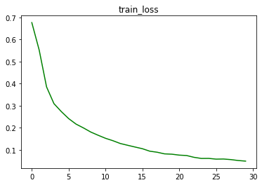

# **4 - RNNs & LSTMs**

**ToDo:** 

1. Refer to online remove RNN and add LSTM to the model. 
2. Refer to this  . 
   1. The questions this time are already mentioned in the file. Take as much time as you want (but less than 7 days), to solve the file. Once you are done, then write your solutions in the quiz. 
   2. Please note that the **Session 4 Assignment Solution** will time out after 15 minutes, as you just have to copy-paste your answers. 


------


## **LSTM_Sentiment_analysis model**

​	We are Replacing the RNN model with LSTM , modifying the code to make it  functional . Please find the RNN model link attached .

https://github.com/Code-Trees/END-GAME/blob/main/Session_4/RNN_model.ipynb

[here]: https://github.com/Code-Trees/END-GAME/blob/main/Session_4/RNN_model.ipynb	"RNN code"

##### **<u>Tokenizer:</u>**  

As this is for learning purpose we are first modifying the **tokenizer Spacy**  to a simple by by adding the below code . **What is tokenizer ?** Tokenization is a way of separating a piece of text into smaller units called tokens. Here, tokens can be either words, characters, or sub words. Hence, tokenization can be broadly classified into 3 types – word, character, and sub word (n-gram characters) tokenization.

```python
# just split the data by " "(space) between the words.
def tokenize(s):
    return s.split(' ')

TEXT = Field(tokenize = tokenize,tokenizer_language = 'en_core_web_sm', lower = True)
LABEL = LabelField(dtype = torch.float)
```


##### **<u>Data prep:</u>** 

Once we have the tokenizer lets Split the data . In our case we have the IMDB rating Dataset. This data set is having  50,000 reviews with target as positive / negative. We will split the data with Train data, Validation_data , Test_data with , 17500,7500,25000 split respectively. 

Once we have the data splits we can build vocab from training data. 

```python
# Build vocabulary for source and target from training data

TEXT.build_vocab(train_data, max_size=25_000)
LABEL.build_vocab(train_data)
```

##### <u>**Model Building :**</u> 

We have the model Code ready from RNN code. Let's modify it with below updates. 

1. Input dim:  The Shape of Vocabulary ,that can be the max length of a sentence. 

2. output_dim : len ([positive, negative]) == 2

3. emb_dim : Dimension of embedding matrix

4. hidden_dim : Num of hidden dimension.

5. n_layer: How many LSTM layers to build

6. dropout: The dropout value 

   ```python
   INPUT_DIM = len(TEXT.vocab)
   OUTPUT_DIM = len(LABEL.vocab)
   
   EMBEDDING_DIM = 100
   HIDDEN_DIM = 256
   
   N_LAYERS = 1
   DROPOUT = 0.6 #We are going hard on the model bu telling to drop 60% of the neurons and learn . 
   ```

```python
class Model(nn.Module):
    def __init__(self, input_dim, output_dim,emb_dim, hidden_dim, n_layers, dropout):
        # input_dim <--- vocabulary size
        # output_dim <--- len ([positive, negative]) == 2 
        # emb_dim <--- embedding dimension of embedding matrix

        super(Model, self).__init__()
        self.n_layers = n_layers
        self.hidden_dim = hidden_dim

        self.embedding = nn.Embedding(input_dim, emb_dim)
        self.rnn = nn.LSTM(emb_dim, hidden_dim, n_layers, dropout=dropout)

        self.fc1 = nn.Linear(hidden_dim, output_dim)
        self.relu = nn.ReLU()
        self.dropout = nn.Dropout(dropout)

    def forward(self, src,Len):
        # shape: [source_len, batch_size]
        embedded = self.dropout(self.embedding(src)) # shape: [src_len, batch_size, embed_dim]
        packed = torch.nn.utils.rnn.pack_padded_sequence(embedded, Len.to('cpu'))
        output, (hidden, cell) = self.rnn(packed) 
        # output shape -> [batch, hidden_dim]
        # hiddden shape -> [n_layers, batch, hidden_dim]
        # cell shape -> [n_layers, batch, hidden_dim]
        output = self.fc1(hidden)
#         output = self.fc2(self.relu(output))
        return output.squeeze(0)
```


We are running the model is Cuda.

```python
def gpu_check(seed_val = 1):
    print('The Seed is set to {}'.format(seed_val))
    if torch.cuda.is_available():
        print('Model will Run on CUDA.')
        print ("Type 'watch nvidia-smi' to monitor GPU\n")
        torch.cuda.manual_seed(seed_val)
        device = 'cuda'
    else:
        torch.manual_seed(seed_val)
        print ('Running in CPU')
        device = 'cpu'
    cuda = torch.cuda.is_available()
    return cuda,seed_val,device
```


```python
In [8]:cuda,SEED,device = gpu_check(seed_val=1234)

The Seed is set to 1234
Model will Run on CUDA.
Type 'watch nvidia-smi' to monitor GPU
```

```shell
+-----------------------------------------------------------------------------+
| NVIDIA-SMI 465.19.01    Driver Version: 460.32.03    CUDA Version: 11.2     |
|-------------------------------+----------------------+----------------------+
| GPU  Name        Persistence-M| Bus-Id        Disp.A | Volatile Uncorr. ECC |
| Fan  Temp  Perf  Pwr:Usage/Cap|         Memory-Usage | GPU-Util  Compute M. |
|                               |                      |               MIG M. |
|===============================+======================+======================|
|   0  Tesla P100-PCIE...  Off  | 00000000:00:04.0 Off |                    0 |
| N/A   53C    P0    43W / 250W |      2MiB / 16280MiB |      0%      Default |
|                               |                      |                  N/A |
+-------------------------------+----------------------+----------------------+
                                                                               
+-----------------------------------------------------------------------------+
| Processes:                                                                  |
|  GPU   GI   CI        PID   Type   Process name                  GPU Memory |
|        ID   ID                                                   Usage      |
|=============================================================================|
|  No running processes found                                                 |
+-----------------------------------------------------------------------------+
```


##### <u>**Train Test Loop : **</u> 

We are using **Adam** as optimiser, Also **lr_scheduler** to find the best Learning rate. Loss as **CrossEntropyLoss**.

Let's create The train loop , evaluate loop to run test loop and validation loop with below code.

```python
def train(EPOCH,model, iterator, optimizer=optimizer, criterion=criterion, clip=1,):
    model.train()
    epoch_loss = 0
    total_correct = 0
    total_count = 0
    pbar = tqdm(iterator)
    for i, batch in enumerate(pbar):
        src,data_len = batch.text
        src = src.to(device)
        trg = batch.label.to(device)
        trg = trg.long()
        optimizer.zero_grad()
        output = model(src,data_len)
        
        total_correct += torch.sum(torch.eq(output.argmax(1), trg))
        total_count+=len(trg)
        
        loss = criterion(output, trg)
        
        loss.backward() 
        torch.nn.utils.clip_grad_norm_(model.parameters(), clip)
        optimizer.step()
        epoch_loss += loss.item()
        pbar.set_description(desc= f'Epoch {EPOCH} Train data Batch No : {i} Loss : {loss.item():.3f} Accuracy : {total_correct/total_count * 100 :.2f}% ' )
    
    train_accuracy.append(total_correct/total_count)
    mean_loss = epoch_loss / len(iterator)
    train_loss.append(mean_loss)
    
    scheduler.step(mean_loss)
```

```python
def evaluate(EPOCH,model, iterator, criterion,typ_loader):
    epoch_loss = 0
    epoch_acc = 0
    model.eval()
    pbar  = tqdm(iterator)
    with torch.no_grad():
        
        for i,batch in enumerate(pbar):
            src,data_len = batch.text
            src = src.to(device)
            trg = batch.label.to(device)
            trg = trg.long()
            predictions = model(src,data_len)
            
            loss = criterion(predictions, trg)
            
            acc = binary_accuracy(predictions, trg)

            epoch_loss += loss.item()
            epoch_acc += acc
            if typ_loader == 'Valid data':
                validation_loss.append(loss)
                validation_accuracy.append(acc)
            elif typ_loader == 'Test data':
                test_loss.append(loss)
                test_accuracy.append(acc)

            pbar.set_description(desc= f'     -->{typ_loader} Loss : {loss.item():.3f} | Accuracy : {epoch_acc / len(iterator)* 100 :.2f}% ' )
```

##### <u>**Model Running And o/p:**</u>

to Run the model we run below code:

###### **EPOCHS = 30**

```python
total_epoch = 30
for epoch in range(total_epoch):
    result = train(epoch,model=model, iterator=train_iterator)
    evaluate(epoch,model,valid_iterator,criterion,'Valid data')
    evaluate(epoch,model,test_iterator,criterion,'Test data')
```

The O/P of our Mehnat is below.



```python
Epoch 0 Train data Batch No : 546 Loss : 0.449 Accuracy : 56.79% : 100%|██████████| 547/547 [00:13<00:00, 39.32it/s]
     			  -->Valid data Loss : 0.774 | Accuracy : 71.41% : 100%|██████████| 235/235 [00:02<00:00, 88.23it/s]
     			   -->Test data Loss : 0.506 | Accuracy : 71.77% : 100%|██████████| 782/782 [00:09<00:00, 81.80it/s]
Epoch 1 Train data Batch No : 546 Loss : 0.547 Accuracy : 71.53% : 100%|██████████| 547/547 [00:13<00:00, 40.02it/s]
     			  -->Valid data Loss : 0.445 | Accuracy : 78.55% : 100%|██████████| 235/235 [00:02<00:00, 89.43it/s]
     			   -->Test data Loss : 0.681 | Accuracy : 78.54% : 100%|██████████| 782/782 [00:08<00:00, 92.40it/s]
Epoch 2 Train data Batch No : 546 Loss : 0.420 Accuracy : 83.29% : 100%|██████████| 547/547 [00:13<00:00, 40.55it/s]
     			  -->Valid data Loss : 0.201 | Accuracy : 86.47% : 100%|██████████| 235/235 [00:02<00:00, 93.01it/s]
     			   -->Test data Loss : 0.601 | Accuracy : 85.86% : 100%|██████████| 782/782 [00:09<00:00, 84.30it/s]
Epoch 3 Train data Batch No : 546 Loss : 0.529 Accuracy : 87.23% : 100%|██████████| 547/547 [00:13<00:00, 39.77it/s]
     			  -->Valid data Loss : 0.481 | Accuracy : 86.98% : 100%|██████████| 235/235 [00:02<00:00, 88.00it/s]
     			   -->Test data Loss : 0.576 | Accuracy : 86.65% : 100%|██████████| 782/782 [00:08<00:00, 90.31it/s]
Epoch 4 Train data Batch No : 546 Loss : 0.324 Accuracy : 89.03% : 100%|██████████| 547/547 [00:13<00:00, 39.90it/s]
     			  -->Valid data Loss : 0.131 | Accuracy : 87.49% : 100%|██████████| 235/235 [00:02<00:00, 89.28it/s]
     			   -->Test data Loss : 0.655 | Accuracy : 86.86% : 100%|██████████| 782/782 [00:09<00:00, 83.97it/s]
Epoch 5 Train data Batch No : 546 Loss : 0.149 Accuracy : 90.48% : 100%|██████████| 547/547 [00:13<00:00, 39.84it/s]
     			  -->Valid data Loss : 0.007 | Accuracy : 87.89% : 100%|██████████| 235/235 [00:02<00:00, 90.65it/s]
     			   -->Test data Loss : 1.167 | Accuracy : 86.95% : 100%|██████████| 782/782 [00:08<00:00, 90.34it/s]
Epoch 6 Train data Batch No : 546 Loss : 0.209 Accuracy : 91.68% : 100%|██████████| 547/547 [00:13<00:00, 39.42it/s]
     			  -->Valid data Loss : 0.223 | Accuracy : 88.34% : 100%|██████████| 235/235 [00:02<00:00, 88.11it/s]
     			   -->Test data Loss : 2.639 | Accuracy : 87.19% : 100%|██████████| 782/782 [00:09<00:00, 80.99it/s]
Epoch 7 Train data Batch No : 546 Loss : 0.183 Accuracy : 92.26% : 100%|██████████| 547/547 [00:13<00:00, 39.57it/s]
     			  -->Valid data Loss : 0.022 | Accuracy : 89.06% : 100%|██████████| 235/235 [00:02<00:00, 91.91it/s]
     			   -->Test data Loss : 1.008 | Accuracy : 88.02% : 100%|██████████| 782/782 [00:08<00:00, 92.93it/s]
Epoch 8 Train data Batch No : 546 Loss : 0.110 Accuracy : 93.11% : 100%|██████████| 547/547 [00:13<00:00, 40.18it/s]
     			  -->Valid data Loss : 0.209 | Accuracy : 89.05% : 100%|██████████| 235/235 [00:02<00:00, 87.43it/s]
     			   -->Test data Loss : 0.940 | Accuracy : 88.05% : 100%|██████████| 782/782 [00:09<00:00, 83.63it/s]
Epoch 9 Train data Batch No : 546 Loss : 0.053 Accuracy : 93.71% : 100%|██████████| 547/547 [00:13<00:00, 39.48it/s]
     			  -->Valid data Loss : 0.044 | Accuracy : 88.88% : 100%|██████████| 235/235 [00:02<00:00, 87.33it/s]
     			   -->Test data Loss : 1.269 | Accuracy : 87.56% : 100%|██████████| 782/782 [00:08<00:00, 90.14it/s]
Epoch 10 Train data Batch No : 546 Loss : 0.345 Accuracy : 94.31% : 100%|██████████| 547/547 [00:13<00:00, 39.68it/s]
     			   -->Valid data Loss : 0.086 | Accuracy : 89.07% : 100%|██████████| 235/235 [00:02<00:00, 89.16it/s]
     			    -->Test data Loss : 1.097 | Accuracy : 88.48% : 100%|██████████| 782/782 [00:09<00:00, 85.30it/s]
Epoch 11 Train data Batch No : 546 Loss : 0.055 Accuracy : 94.61% : 100%|██████████| 547/547 [00:13<00:00, 39.84it/s]
     			   -->Valid data Loss : 0.117 | Accuracy : 89.23% : 100%|██████████| 235/235 [00:02<00:00, 88.73it/s]
     			    -->Test data Loss : 1.530 | Accuracy : 88.33% : 100%|██████████| 782/782 [00:08<00:00, 90.74it/s]
Epoch 12 Train data Batch No : 546 Loss : 0.121 Accuracy : 95.37% : 100%|██████████| 547/547 [00:13<00:00, 39.37it/s]
     			   -->Valid data Loss : 0.290 | Accuracy : 88.83% : 100%|██████████| 235/235 [00:02<00:00, 88.69it/s]
     			    -->Test data Loss : 1.773 | Accuracy : 88.07% : 100%|██████████| 782/782 [00:09<00:00, 82.67it/s]
Epoch 13 Train data Batch No : 546 Loss : 0.093 Accuracy : 95.64% : 100%|██████████| 547/547 [00:13<00:00, 39.46it/s]
     			   -->Valid data Loss : 0.044 | Accuracy : 88.99% : 100%|██████████| 235/235 [00:02<00:00, 88.12it/s]
     			    -->Test data Loss : 1.955 | Accuracy : 88.00% : 100%|██████████| 782/782 [00:08<00:00, 90.07it/s]
Epoch 14 Train data Batch No : 546 Loss : 0.265 Accuracy : 95.86% : 100%|██████████| 547/547 [00:13<00:00, 39.35it/s]
     			   -->Valid data Loss : 0.043 | Accuracy : 87.70% : 100%|██████████| 235/235 [00:02<00:00, 90.23it/s]
     			    -->Test data Loss : 2.702 | Accuracy : 85.95% : 100%|██████████| 782/782 [00:09<00:00, 82.32it/s]
Epoch 15 Train data Batch No : 546 Loss : 0.200 Accuracy : 96.25% : 100%|██████████| 547/547 [00:13<00:00, 39.46it/s]
     			   -->Valid data Loss : 0.297 | Accuracy : 89.11% : 100%|██████████| 235/235 [00:02<00:00, 88.36it/s]
     			    -->Test data Loss : 1.150 | Accuracy : 87.97% : 100%|██████████| 782/782 [00:08<00:00, 88.77it/s]
Epoch 16 Train data Batch No : 546 Loss : 0.009 Accuracy : 96.69% : 100%|██████████| 547/547 [00:13<00:00, 39.60it/s]
     			   -->Valid data Loss : 0.097 | Accuracy : 88.93% : 100%|██████████| 235/235 [00:02<00:00, 86.73it/s]
     			    -->Test data Loss : 1.279 | Accuracy : 87.54% : 100%|██████████| 782/782 [00:09<00:00, 81.94it/s]
Epoch 17 Train data Batch No : 546 Loss : 0.047 Accuracy : 96.85% : 100%|██████████| 547/547 [00:13<00:00, 39.71it/s]
     			   -->Valid data Loss : 0.160 | Accuracy : 89.17% : 100%|██████████| 235/235 [00:02<00:00, 87.82it/s]
     			    -->Test data Loss : 1.306 | Accuracy : 87.53% : 100%|██████████| 782/782 [00:08<00:00, 89.29it/s]
Epoch 18 Train data Batch No : 546 Loss : 0.097 Accuracy : 97.18% : 100%|██████████| 547/547 [00:13<00:00, 39.99it/s]
     			   -->Valid data Loss : 0.365 | Accuracy : 88.67% : 100%|██████████| 235/235 [00:02<00:00, 92.18it/s]
     			    -->Test data Loss : 0.902 | Accuracy : 87.78% : 100%|██████████| 782/782 [00:09<00:00, 84.98it/s]
Epoch 19 Train data Batch No : 546 Loss : 0.066 Accuracy : 97.16% : 100%|██████████| 547/547 [00:13<00:00, 39.89it/s]
     			   -->Valid data Loss : 0.042 | Accuracy : 89.02% : 100%|██████████| 235/235 [00:02<00:00, 87.48it/s]
     			    -->Test data Loss : 1.078 | Accuracy : 87.50% : 100%|██████████| 782/782 [00:08<00:00, 88.47it/s]
Epoch 20 Train data Batch No : 546 Loss : 0.190 Accuracy : 97.42% : 100%|██████████| 547/547 [00:13<00:00, 39.34it/s]
     			   -->Valid data Loss : 0.076 | Accuracy : 89.02% : 100%|██████████| 235/235 [00:02<00:00, 87.91it/s]
     			    -->Test data Loss : 0.930 | Accuracy : 86.97% : 100%|██████████| 782/782 [00:09<00:00, 83.87it/s]
Epoch 21 Train data Batch No : 546 Loss : 0.012 Accuracy : 97.50% : 100%|██████████| 547/547 [00:13<00:00, 39.66it/s]
     			   -->Valid data Loss : 0.422 | Accuracy : 88.73% : 100%|██████████| 235/235 [00:02<00:00, 87.68it/s]
     			    -->Test data Loss : 1.097 | Accuracy : 87.36% : 100%|██████████| 782/782 [00:08<00:00, 88.95it/s]
Epoch 22 Train data Batch No : 546 Loss : 0.018 Accuracy : 97.83% : 100%|██████████| 547/547 [00:13<00:00, 39.42it/s]
     			   -->Valid data Loss : 0.526 | Accuracy : 88.67% : 100%|██████████| 235/235 [00:02<00:00, 86.20it/s]
     			    -->Test data Loss : 1.127 | Accuracy : 87.00% : 100%|██████████| 782/782 [00:09<00:00, 82.77it/s]
Epoch 23 Train data Batch No : 546 Loss : 0.024 Accuracy : 97.90% : 100%|██████████| 547/547 [00:13<00:00, 39.76it/s]
     			   -->Valid data Loss : 0.410 | Accuracy : 89.05% : 100%|██████████| 235/235 [00:02<00:00, 88.04it/s]
     			    -->Test data Loss : 1.399 | Accuracy : 87.10% : 100%|██████████| 782/782 [00:08<00:00, 89.85it/s]
Epoch 24 Train data Batch No : 546 Loss : 0.029 Accuracy : 97.82% : 100%|██████████| 547/547 [00:13<00:00, 39.09it/s]
     			   -->Valid data Loss : 0.349 | Accuracy : 88.62% : 100%|██████████| 235/235 [00:02<00:00, 85.50it/s]
     			    -->Test data Loss : 1.263 | Accuracy : 86.88% : 100%|██████████| 782/782 [00:09<00:00, 80.25it/s]
Epoch 25 Train data Batch No : 546 Loss : 0.008 Accuracy : 98.09% : 100%|██████████| 547/547 [00:13<00:00, 39.23it/s]
     			   -->Valid data Loss : 0.409 | Accuracy : 88.66% : 100%|██████████| 235/235 [00:02<00:00, 88.64it/s]
     			    -->Test data Loss : 2.537 | Accuracy : 86.64% : 100%|██████████| 782/782 [00:08<00:00, 89.07it/s]
Epoch 26 Train data Batch No : 546 Loss : 0.005 Accuracy : 97.94% : 100%|██████████| 547/547 [00:13<00:00, 39.66it/s]
     			   -->Valid data Loss : 0.147 | Accuracy : 88.38% : 100%|██████████| 235/235 [00:02<00:00, 91.57it/s]
     			    -->Test data Loss : 1.852 | Accuracy : 86.29% : 100%|██████████| 782/782 [00:08<00:00, 87.70it/s]
Epoch 27 Train data Batch No : 546 Loss : 0.020 Accuracy : 98.04% : 100%|██████████| 547/547 [00:13<00:00, 39.78it/s]
     			   -->Valid data Loss : 0.372 | Accuracy : 88.05% : 100%|██████████| 235/235 [00:02<00:00, 88.36it/s]
     			    -->Test data Loss : 1.935 | Accuracy : 85.97% : 100%|██████████| 782/782 [00:08<00:00, 89.03it/s]
Epoch 28 Train data Batch No : 546 Loss : 0.022 Accuracy : 98.16% : 100%|██████████| 547/547 [00:13<00:00, 39.56it/s]
     			   -->Valid data Loss : 0.014 | Accuracy : 88.12% : 100%|██████████| 235/235 [00:02<00:00, 87.21it/s]
     			    -->Test data Loss : 2.231 | Accuracy : 85.51% : 100%|██████████| 782/782 [00:09<00:00, 82.18it/s]
Epoch 29 Train data Batch No : 546 Loss : 0.166 Accuracy : 98.32% : 100%|██████████| 547/547 [00:13<00:00, 39.47it/s]
     			   -->Valid data Loss : 0.521 | Accuracy : 88.40% : 100%|██████████| 235/235 [00:02<00:00, 87.30it/s]
     			    -->Test data Loss : 1.215 | Accuracy : 86.52% : 100%|██████████| 782/782 [00:08<00:00, 88.75it/s]
```

The model is over fit   in 30 epochs 

**Train Accuracy : ------------> 98.32%  **

**Validation Accuracy  -----> 88.40% **

**Test Accuracy :--------------> 86.52%  **


Model performance has increased. Train accuracy increased from 56.79% to 98.32%  .But Test and validation accuracy is still not better compare to Train. Is it over fitting now ? YES .  Is it worth running it for higher number of epoch with the Given result ? I don't think so .it performs Better than before but not marginally better because of over fit. We can try some regularisation techniques 
